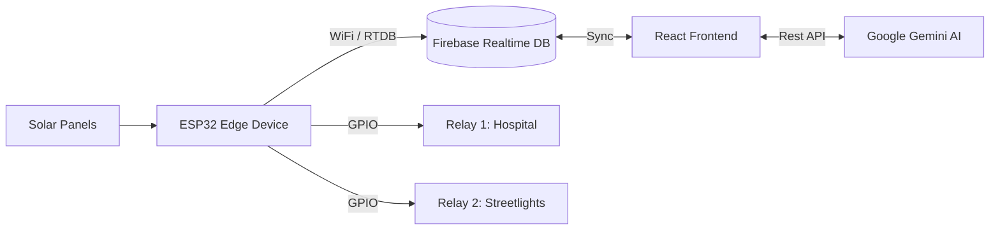

<div align="center">
  
  
  # SolarGrid Microgrid OS ⚡
  
  **Next-Generation AI-Driven Microgrid Controller for SIH 2026**
  
  [](#)
  [](#)
  [](#)
  [](#)
  [](#)
</div>

<br/>

## 🌟 Overview
**SolarGrid** is an advanced, real-time microgrid operating system designed for Smart Grid deployments. It combines hardware Edge processing (ESP32) with a cutting-edge cloud architecture (Firebase Realtime Database) and an AI decision engine (Google Gemini) to intelligently route power and prevent critical battery depletion.

With a sleek **GenZ Cyberpunk Glassmorphism** user interface, SolarGrid provides operators with a full HUD for controlling physical relays, monitoring solar telemetry, and interacting with GridBot, an AI that acts as a co-pilot for grid emergencies.

## 🚀 Key Features
- **Real-Time Telemetry**: Live dashboard showing Solar Voltage, Battery SoC, Active Load Watts, and Grid Strain, synced instantaneously from the ESP32 via Firebase RTDB.
- **Dynamic Load Management**: Control physical hardware relays remotely. Dynamically edit connected devices, assign priority levels (Critical, High, Medium, Low), and set power draw parameters.
- **AI Co-Pilot (GridBot)**: Integrated Gemini AI engine acts as a microgrid expert. In emergencies (like unexpected battery drops), the AI suggests or executes load-shedding protocols based on priority. 
- **Local Fallback Engine**: If cloud AI is unavailable, a local deterministic algorithm evaluates the battery threshold and sheds lower-priority loads to preserve critical infrastructure.
- **Cyberpunk HUD**: An ultra-wide, animated, responsive React dashboard that looks straight out of a sci-fi command center.

## 🏗️ Architecture



## 🛠️ Tech Stack
- **Frontend**: React, TypeScript, Vite, Framer Motion, Lucide Icons.
- **Backend/DB**: Firebase Realtime Database, Firebase Authentication (Google Provider).
- **Hardware**: ESP32, Solar Charge Controller, 18650 Battery Pack, Optoisolated Relays.
- **AI Integrations**: Google Gemini API, Groq (Fallback), Local Heuristics.

## ⚙️ Quick Start

### 1. Hardware Setup (ESP32)
Flash `firmware/SolarGridESP32.ino` to your ESP32. Ensure you have the Firebase ESP Client library installed. Update your WiFi credentials and Firebase Realtime Database URL inside the sketch.

### 2. Frontend Setup
Navigate into the `frontend` directory and install dependencies:
```bash
cd frontend
npm install
npm run dev
```

### 3. Environment Variables
Create a `.env` file in the `frontend` folder with your API keys:
```env
VITE_GEMINI_API_KEY=your_gemini_key
VITE_GROQ_API_KEY=your_groq_key
```

---
<div align="center">
  <i>Built for Smart Grid Innovation • SIH 2026</i>
</div>
